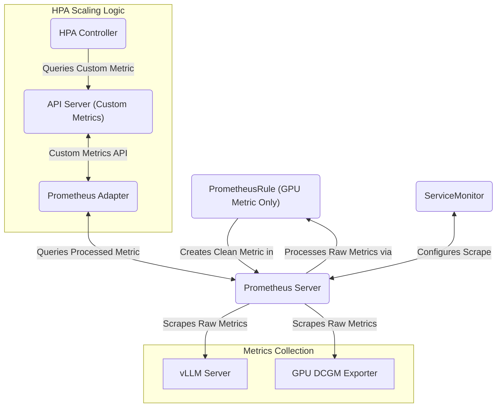

# Horizontal Pod Autoscaling AI Inference Server

This exercise shows how to set up the infrastructure to automatically
scale an AI inference server, using custom metrics (either server
or GPU metrics). This exercise requires a running Prometheus instance,
preferably managed by the Prometheus Operator. We assume
you already have the vLLM AI inference server running from this
[exercise](../README.md), in the parent directory.

> **NOTE on Cloud-Provider Compatibility:**
> This guide is designed to be as cloud-provider compatible as possible. The
> primary component that varies across cloud providers is the **NVIDIA DCGM
> Exporter**, which is responsible for collecting GPU metrics.
>
> - **GKE** provides a managed, auto-installed DCGM exporter.
> - **EKS and AKS** require a manual installation of the DCGM exporter.
>
> Consequently, the `Service` and `ServiceMonitor` configurations for the DCGM
> exporter are also provider-specific. This guide provides separate manifests
> for both GKE and generic (manual) installations.
>
> The rest of the autoscaling pipeline is intentionally configured to be generic.
> By installing the open-source **Prometheus Operator**, we avoid dependencies on
> provider-specific managed monitoring services, ensuring the core of this
> solution runs on any Kubernetes cluster.

## Architecture

The autoscaling solution works as follows:

1.  The **vLLM Server** or the **NVIDIA DCGM Exporter** exposes raw metrics on a `/metrics` endpoint.
2.  A **ServiceMonitor** resource declaratively specifies how Prometheus should discover and scrape these metrics.
3.  The **Prometheus Operator** detects the `ServiceMonitor` and configures its managed **Prometheus Server** instance to begin scraping the metrics.
4.  For GPU metrics, a **PrometheusRule** is used to relabel the raw DCGM metrics, creating a new, HPA-compatible metric.
5.  The **Prometheus Adapter** queries the Prometheus Server for the processed metrics and exposes them through the Kubernetes custom metrics API.
6.  The **Horizontal Pod Autoscaler (HPA)** controller queries the custom metrics API for the metrics and compares them to the target values defined in the `HorizontalPodAutoscaler` resource.
7.  If the metrics exceed the target, the HPA scales up the `vllm-gemma-deployment`.

## Prerequisites

This guide assumes you have a running Kubernetes cluster and `kubectl` installed. The vLLM server will be deployed in the `vllm-example` namespace, and the Prometheus resources will be in the `monitoring` namespace. The HPA resources will be deployed to the `vllm-example` namespace by specifying the namespace on the command line.

> **Note on Cluster Permissions:** This exercise requires permissions to install components that run on the cluster nodes themselves. The Prometheus Operator and the NVIDIA DCGM Exporter both deploy DaemonSets that require privileged access to the nodes to collect metrics. For GKE users, this means a **GKE Standard** cluster is required, as GKE Autopilot's security model restricts this level of node access.

### Prometheus Operator Installation

The HPA setup requires a running Prometheus instance, preferably managed by the
Prometheus Operator. Detailed installation instructions are provided in the
guides for both [vLLM metrics](./vllm-hpa.md) and [GPU metrics](./gpu-hpa.md).

## I. HPA for vLLM AI Inference Server using vLLM metrics

[vLLM AI Inference Server HPA](./vllm-hpa.md)

## II. HPA for vLLM AI Inference Server using NVidia GPU metrics

[vLLM AI Inference Server HPA with GPU metrics](./gpu-hpa.md)

### Choosing the Right Metric: Trade-offs and Combining Metrics

This project provides two methods for autoscaling: one based on the number of running requests (`vllm:num_requests_running`) and the other on GPU utilization (`dcgm_fi_dev_gpu_util`). Each has its own advantages, and they can be combined for a more robust scaling strategy.

#### **Trade-offs**

*   **Number of Running Requests (Application-Level Metric):**
    *   **Pros:** This is a direct measure of the application's current workload. It is highly responsive to sudden changes in traffic, making it ideal for latency-sensitive applications. Scaling decisions are based on the actual number of requests being processed, which can be a more accurate predictor of future load than hardware utilization alone.
    *   **Cons:** This metric may not always correlate directly with resource consumption. For example, a few computationally expensive requests could saturate the GPU, while a large number of simple requests might not. If the application has issues reporting this metric, the HPA will not be able to scale the deployment correctly.

*   **GPU Utilization (Hardware-Level Metric):**
    *   **Pros:** This provides a direct measurement of how busy the underlying hardware is. It is a reliable indicator of resource saturation and is useful for optimizing costs by scaling down when the GPU is underutilized.
    *   **Cons:** GPU utilization can be a lagging indicator. By the time utilization is high, the application's latency may have already increased. It also does not distinguish between a single, intensive request and multiple, less demanding ones.

#### **Combining Metrics for Robustness**

For the most robust autoscaling, you can configure the HPA to use multiple metrics. For example, you could scale up if *either* the number of running requests exceeds a certain threshold *or* if GPU utilization spikes. The HPA will scale the deployment up if any of the metrics cross their defined thresholds, but it will only scale down when *all* metrics are below their target values (respecting the scale-down stabilization window).

This combined approach provides several benefits:
- **Proactive Scaling:** The HPA can scale up quickly in response to an increase in running requests, preventing latency spikes.
- **Resource Protection:** It can also scale up if a small number of requests are consuming a large amount of GPU resources, preventing the server from becoming overloaded.
- **Cost-Effective Scale-Down:** The deployment will only scale down when both the request load and GPU utilization are low, ensuring that resources are not removed prematurely.
