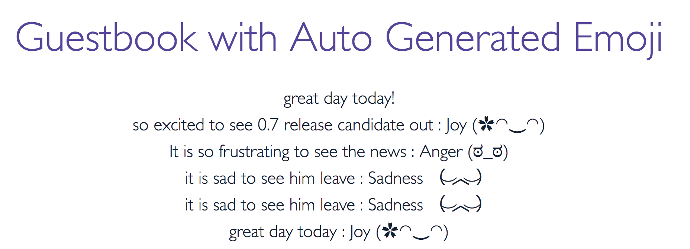

## Guestbook Example

This example was forked from the official kubernetes [guestbook-go](https://github.com/kubernetes/examples/tree/master/guestbook-go) example.   It shows how to build a simple multi-tier web application using Kubernetes and Docker. The application consists of a web front end, Redis master for storage, and replicated set of Redis slaves, all for which we will create Kubernetes replication controllers, pods, and services.

As part of the journey to move the application to Istio service mesh, the guestbook application and service is moved to run in Istio.  Also, the guestbook application has been modernized so it can generate a cute emoji upon every single guest comment, by leveraging machine learning capability from IBM [Watson Tone Anazlyer](https://www.ibm.com/watson/services/tone-analyzer/).

##### Table of Contents

 * [Step Zero: Prerequisites](#step-zero)
 * [Step One: Create the guestbook deployment and service](#step-one)
 * [Step Two: View the guestbook](#step-two)
 * [Step Three: Modernize the guestbook](#step-three)
 * [Step Four: Create the analyzer service](#step-four)
 * [Step Five: View the modernized guestbook](#step-five)
 * [Step Six: Cleanup](#step-six)

### Step Zero: Prerequisites <a id="step-zero"></a>

This example assumes that you have a working cluster. See the [Getting Started Guides](https://kubernetes.io/docs/setup/) for details about creating a cluster.

**Tip:** View all the `kubectl` commands, including their options and descriptions in the [kubectl CLI reference](https://kubernetes.io/docs/user-guide/kubectl-overview/).

Please follow the the [steps](https://github.com/kubernetes/examples/blob/master/guestbook-go/README.md) in the original example to create the redis master pod and service, create the redis slave pod and service.

Also, please follow the [istio.io](http://istio.io) official document to install Istio without mTLS on your k8s cluster.

### Step One: Create the guestbook deployment and service <a id="step-one"></a>

This is a simple Go `net/http` ([negroni](https://github.com/codegangsta/negroni) based) server that is configured to talk to either the slave or master services depending on whether the request is a read or a write. The pods we are creating expose a simple JSON interface and serves a jQuery-Ajax based UI. Like the Redis read slaves, these pods are also managed by a replication controller.

1. Use the [guestbook-deployment.yaml](guestbook-deployment.yaml) file to create the guestbook deployment by running the `kubectl create -f` *`filename`* command:

    ```console
    $ kubectl apply -f <(istioctl kube-inject -f guestbook-deployment.yaml --debug)
    ```

2. To verify that the guestbook deployment is running, run the `kubectl get deloyment` command.

3. To verify that the guestbook pods are running (it might take up to thirty seconds to create the pods), list the pods you created in cluster with the `kubectl get pods` command.

    Result: You see a single Redis master, two Redis slaves, and three guestbook pods.

4. Use the [guestbook-service.yaml](guestbook-service.yaml) file to create the guestbook service by running the `kubectl create -f` *`filename`* command:

    ```console
    $ kubectl create -f guestbook-service.yaml
    ```
5. To verify that the guestbook service is up, list the services you created in the cluster with the `kubectl get services` command:

    ```console
    $ kubectl get services
    NAME              CLUSTER_IP       EXTERNAL_IP       PORT(S)       SELECTOR               AGE
    guestbook         10.0.217.218     146.148.81.8      3000/TCP      app=guestbook          1h
    redis-master      10.0.136.3       <none>            6379/TCP      app=redis,role=master  1h
    redis-slave       10.0.21.92       <none>            6379/TCP      app-redis,role=slave   1h
    ...
    ```

    Result: The service is created with label `app=guestbook`.

### Step Two: View the guestbook <a id="step-two"></a>

You can now play with the guestbook that you just created by opening it in a browser (it might take a few moments for the guestbook to come up).

 * **Local Host:**
    If you are running Kubernetes locally, to view the guestbook, navigate to `http://localhost:3000` in your browser.

 * **Remote Host:**
    1. To view the guestbook on a remote host, locate the external IP of the load balancer in the **IP** column of the `kubectl get services` output. In our example, the internal IP address is `10.0.217.218` and the external IP address is `146.148.81.8` (*Note: you might need to scroll to see the IP column*).

    2. Append port `3000` to the IP address (for example `http://146.148.81.8:3000`), and then navigate to that address in your browser.

    Result: The guestbook displays in your browser:

    

### Step Three: Create the modernized guestbook v2 deployment and service <a id="step-three"></a>

1. Use the [guestbook-v2-deployment.yaml](guestbook-v2-deployment.yaml) file to create the guestbook deployment by running the `kubectl create -f` *`filename`* command:

    ```console
    $ kubectl apply -f <(istioctl kube-inject -f guestbook-v2-deployment.yaml --debug)
    ```

2. To verify that the guestbook v2 deployment is running, run the `kubectl get deloyment` command.

3. To verify that the guestbook v2 pods are running (it might take up to thirty seconds to create the pods), list the pods you created in cluster with the `kubectl get pods` command.

    Result: You see a single Redis master, two Redis slaves, three guestbook pods and three guestbook-v2 pods.

5. To verify that the guestbook service is up, list the services you created in the cluster with the `kubectl get services` command:

    ```console
    $ kubectl get services
    NAME              CLUSTER_IP       EXTERNAL_IP       PORT(S)       SELECTOR               AGE
    guestbook         10.0.217.218     146.148.81.8      3000/TCP      app=guestbook          1h
    redis-master      10.0.136.3       <none>            6379/TCP      app=redis,role=master  1h
    redis-slave       10.0.21.92       <none>            6379/TCP      app-redis,role=slave   1h
    ...
    ```

    Result: The service is created with label `app=guestbook`.


### Step Four: Create the analyzer service <a id="step-four"></a>
 
1. Deploy Watson Tone analyzer service.

    ```console
    $ bx service create tone_analyzer lite my-tone-analyzer-service
      bx service key-create my-tone-analyzer-service myKey
      bx service key-show my-tone-analyzer-service myKey
    ```

2. Find our the username and password from the prior step and update analyzer-deployment.yaml with the username and password in the env var section.  

3. Deploy the analyzer service.  The analyzer service talks to Watson Tone analyzer to help analyze the tone of a message. 

    ```console
    $ kubectl apply -f <(istioctl kube-inject -f analyzer-deployment.yaml --debug)
    ```
4. Apply the egress:

    ```console
    $ kubectl apply -f analyzer-egress.yaml
    ```

### Step Five: View the modernized guestbook <a id="step-five"></a>

1. You should be able to access the guestbook now via the load balancer IP.  However, you can't control traffic.   Let's config istio-ingress to work with the guestbook.

    ```console
    $ kubectl apply -f guestbook-ingress.yaml
    ```

2. If you want to focus on testing guestbook-v2, you may apply route rule to tweak your testing.  For example, applying the route rule to shift all traffic to guestbook-v2.

    ```console
    $ kubectl apply -f routerule-all-v2.yaml
    ```
    
3. View the guestbook via Istio-ingress.

    Result: The guestbook displays in your browser.  As you can see, as guest type messages in the guestbook, an emoji will be automatically generated based on the tone of the message, when the traffic goes to guestbook-v2.

    

### Step Six: Cleanup <a id="step-six"></a>

After you're done playing with the guestbook, you can cleanup by deleting the guestbook service and removing the associated resources that were created, including load balancers, forwarding rules, target pools, and Kubernetes deployments and services.

Delete all the resources by running the following `kubectl delete -f` *`filename`* command:

```console
$ kubectl delete -f examples/guestbook-go
```

Follow istio uninstall instruction to uninstall Istio.
